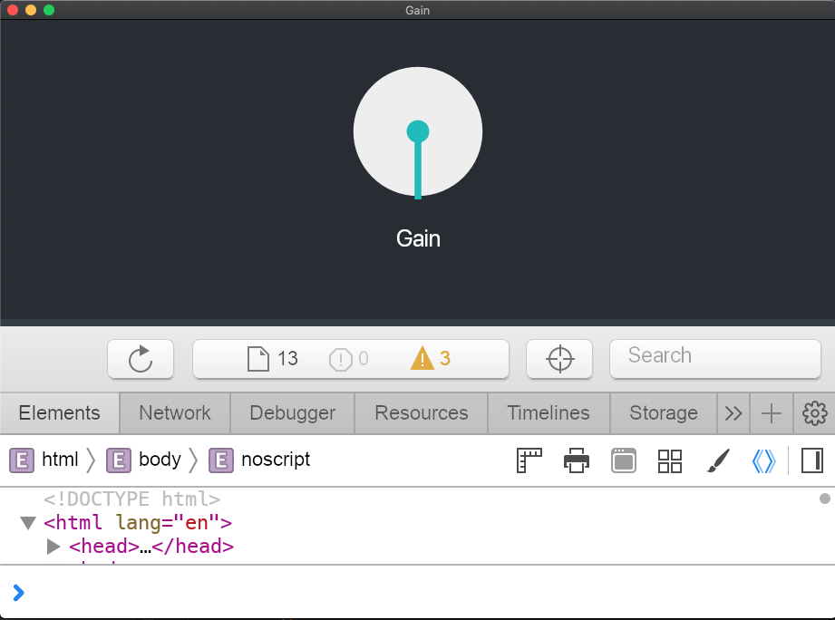
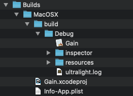
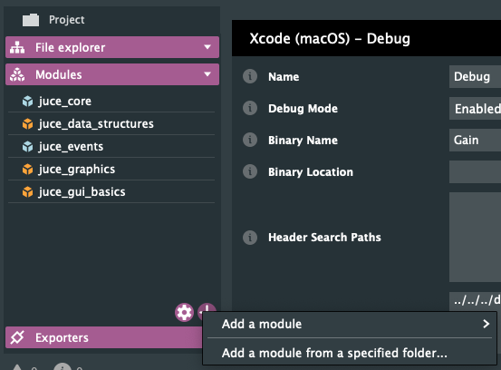

# JUCE Ultralight

This repo will allow you to easily control JUCE applications using a web (HTML, CSS and Javascript) interface and development tools. Pull requests, raising issues, letting us know how you're using it all very welcome :)

Currently tested on macOS



## Running the example

1) Clone this repo and its submodules:
```
$ git clone --recurse-submodules git@github.com:remaininlight/juce-ultralight.git
```

2) In examples/gain/Source/web-ui start the web application by running:
```
$ yarn install
$ npm start
```
If successful, it should serve a web app on port 3000 and you should see:
```
Compiled successfully!

You can now view gain in the browser.

  Local:            http://localhost:3000
  On Your Network:  http://xxx.xxx.x.xx:3000

Note that the development build is not optimized.
To create a production build, use yarn build.
```

3) Open examples/gain/Builds/MacOSX/Gain.xcodeproj and run it

## Using the web debug tools

1) Copy dependencies/ultralight-sdk/bin/resources and dependencies/ultralight-sdk/inspector into the same directory as your built project executable. In the case of the Gain example it should look like this:



2) When you initialise the UltraLightComponent, pass true for the showInspector parameter

## Adding to an existing project

To add the Ultralight module to an existing Projucer project:

1) In the Projucer click on the plus at the bottom right of 'Modules' and select 'Add a module from a specified folder...'



2) Select the ultralight directory in the base of this repo

3) You should then be able to use web interfaces in your projects, see the examples directory
